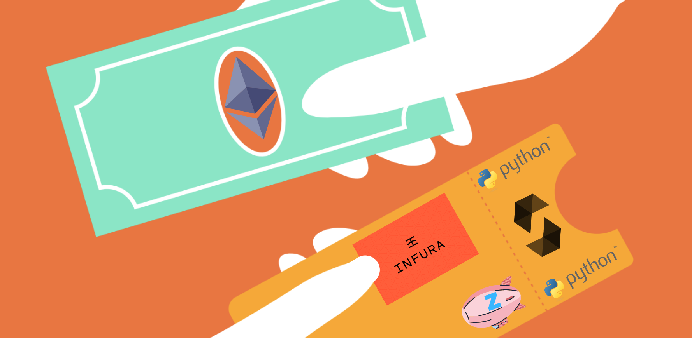
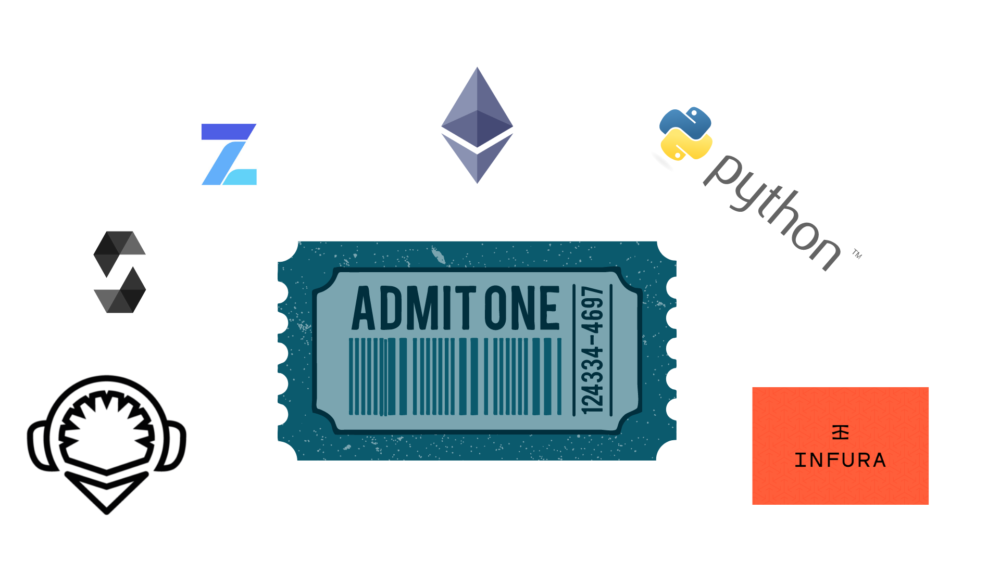
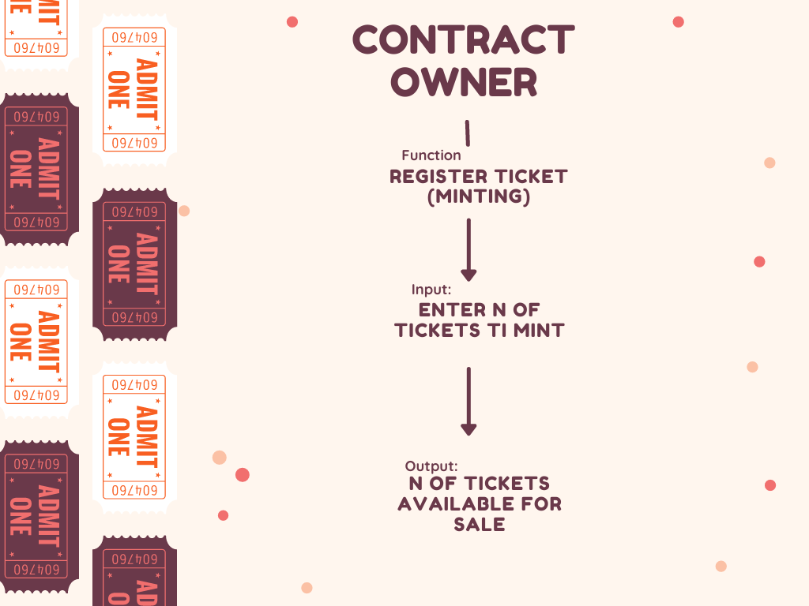
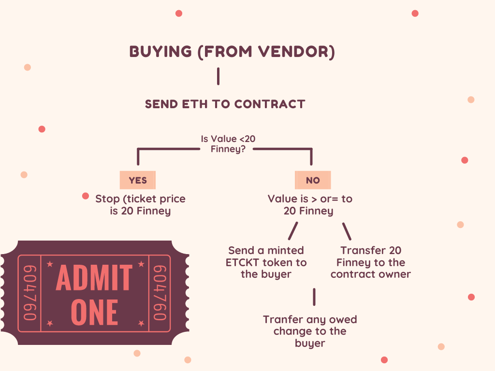
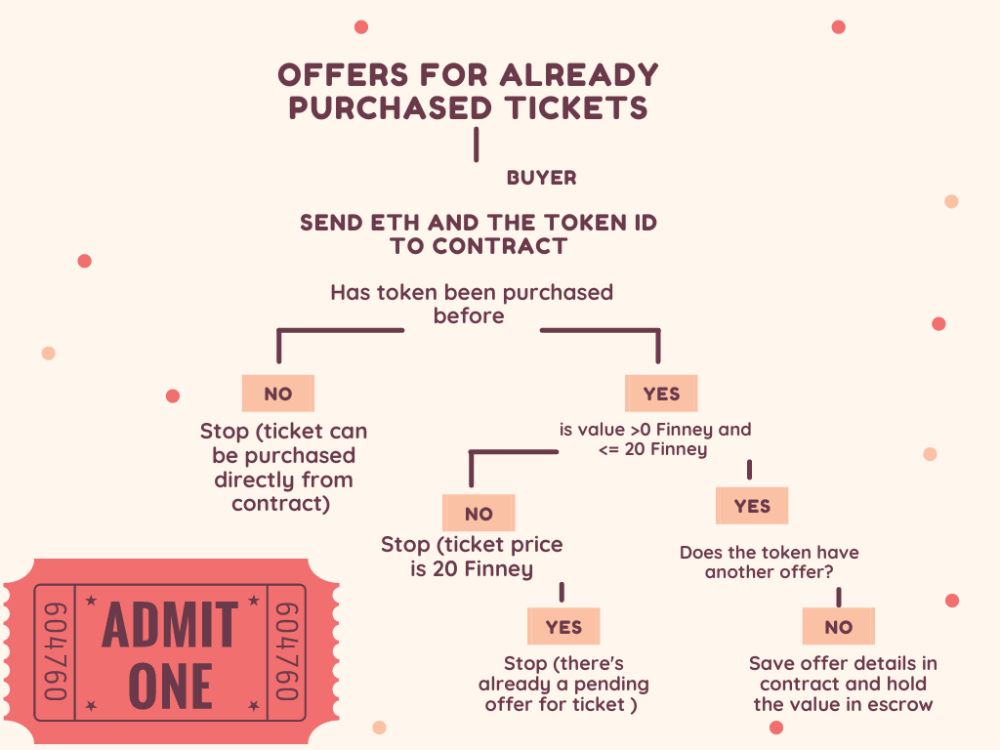
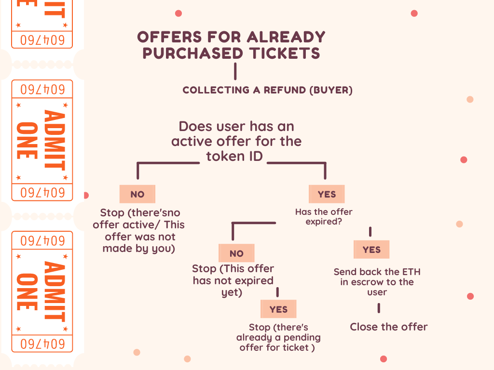
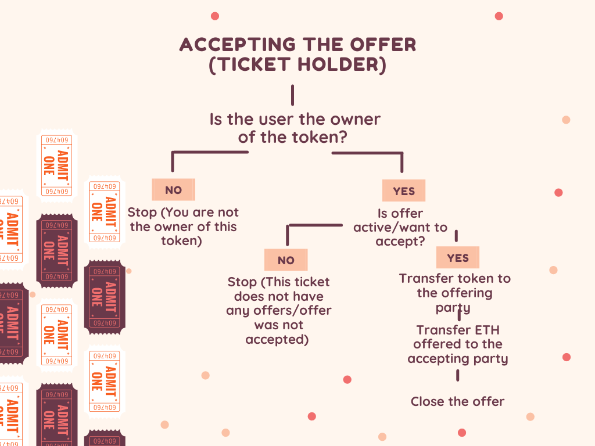
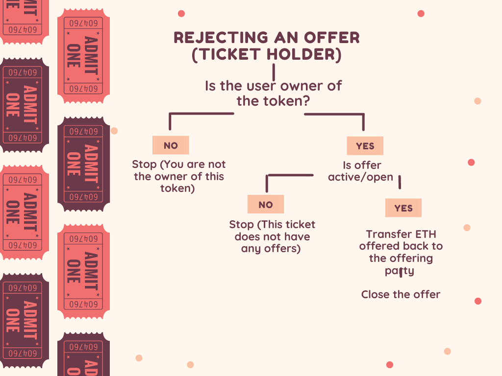

# TicketBlock: On-Chain Event Sales 

#### Team members:
#### Sinan Colpan, Carolina Corona, Chimdike Ihe, Dave Dwarakan, Justin Gouin
---

# Contents:

- [OBJECTIVE](#objective)

- [TECHNOLOGIES](#technologies)

- [VIDEO DEMO](#video-demo)
   
- [FUNCTIONS](#functions)
	- [Minting](#minting)

    - [Evaluating & Tuning](#evaluating-&-tuning)

	- [Prediciton](#prediction)	
	
- [CONCLUSION](#conclusion)

### Objective:

TicketBlock is a decentralized application that offers full-stack blockchain solutions for ticket providers. Our customers are guided through the process of setting up private chains on which they are able to offer and monitor ticket sales and resales. 

### Technologies:

- Solidity on [Remix](https://remix.ethereum.org/#optimize=false&runs=200&evmVersion=null)
- [OpenZeppelin](https://github.com/OpenZeppelin)
- Python on Jupyter notebook
- Go Ethereum 
- IPFS Companion 
- Web3
- [Infura](https://infura.io)
- Using [Rinkeby testnet](https://faucet.rinkeby.io)
- [Ganache](https://www.trufflesuite.com/ganache)

---
## Video Demo
[HERE](https://youtu.be/Ih6cbqdMljA)

---

### Functions

- Minting

- Buying a ticket from the vendor

- Buying a ticket from another user

- Collecting a refund

- Accepting an offer from another user

- Rejecting an offer

